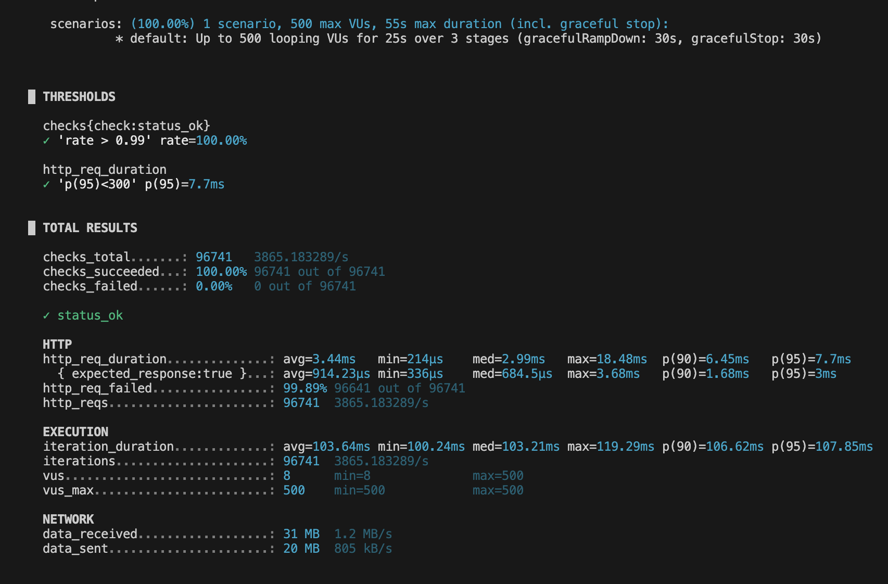

# Flash Sale System (WIP)

## 🎯 Project Goal

A high-concurrency PoC for handling 10k+ RPS during ticket sales.

## 🏗 Current Architecture

- **NestJS Monorepo** (Workspaces)
- **API Gateway:** Request ingestion & Lua script execution.
- **Order Worker:** Background processing for PostgreSQL persistence.
- **Notification Service:** Real-time updates via SSE.

## Monorepo Tooling

- **NestJS Workspace:** service structure, backend build targets, shared backend libraries
- **Turborepo:** cross-workspace orchestration for `build`, `dev`, `lint`, and `test`

### Useful Commands

- `npm run build` runs workspace builds through Turbo
- `npm run dev` starts the backend services in parallel through Turbo
- `npm run dev --workspace=@flash-sale/api-gateway` starts only the API Gateway
- `npm run dev --workspace=@flash-sale/order-worker` starts only the Order Worker
- `npm run dev --workspace=@flash-sale/notification-service` starts only the Notification Service

## 📄 Documentation

- [Architecture Decisions (ADR)](./docs/adr/)
- [System Diagram (C4)](./docs/architecture/flash-sale-c4-container.mmd)

## 🛠 Tech Stack (Confirmed)

- NestJS, ioredis, TypeORM, PostgreSQL, BullMQ.

## Checkout Contract

- Guest checkout uses `customerEmail` as the reservation identity.
- The API normalizes the email and enforces one reservation per event per email.
- This keeps the current PoC auth-free while preserving a realistic frontend contract for Next.js.

# 🚀 Performance Report

This document presents the results of stress tests for the Flash Sale system, conducted using the **k6** tool. The tests were designed to validate the stability of the microservices architecture and the atomicity of transactions in Redis.

## 📊 Results Summary

| Metric                      | Value          | Description                                      |
| :-------------------------- | :------------- | :----------------------------------------------- |
| **Total Requests**          | **96,741**     | Processed within 25 seconds                      |
| **Throughput**              | **~3,865 RPS** | Number of requests handled per second by the API |
| **Average Response Time**   | **3.44 ms**    | Mean across all requests                         |
| **p(95) Latency**           | **7.70 ms**    | 95% of users received a response under 8ms       |
| **Success Rate (Business)** | **100.00%**    | No 500 errors, correct 201/400 statuses          |
| **System Errors**           | **0**          | No timeouts or container failures                |

## 🛡️ Data Integrity & Consistency

During the test (load of ~3.9k RPS), the following was verified:

- **Redis Atomicity:** The Lua script correctly reduced the stock to zero, preventing any overselling.
- **Queue Performance:** BullMQ accepted all orders, and the worker processed them asynchronously, ensuring eventual consistency in PostgreSQL.
- **Final State:** The database contains exactly **100 orders**, and Redis stock equals **0**.

## 🛠️ How to Reproduce the Test

1. Provision infrastructure using Terraform: `terraform apply`
2. Initialize stock: `curl -X POST ... /tickets/init`
3. Run the load test: `npm run test:load`

### Visual Proof (k6 Metrics)

_Note: The terminal output confirms that thresholds for latency and success rate were fully met._

---
